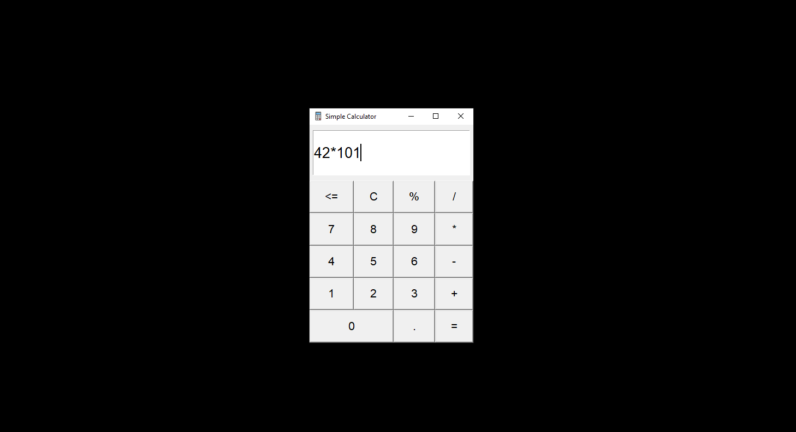
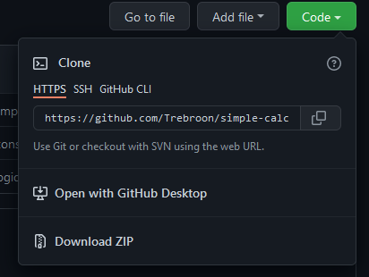

# Simple Calculator

>Simple calculator application created with Python and Tkinter.

---

## Table of Contents

- [Description](#description)
- [Installation](#installation)
- [How To Use](#how-to-use)
- [Room For Improvement](#room-for-improvement)
- [Contact](#contact)

---

## Description

Simple calculator application created with Python and it's build in libary for graphical user interfaces Tkinter.

---

## Installation

Before you can use this calculator, there are few step, you need to do, to be able to run it. 

### Python

First you need to have Python installed on your OS. You can download Python from its offcial website [python.org](https://www.python.org/downloads/) and install it.

### Cloning Repo

After you have successfully installed python, you need to clone this repo to your computer. You can do this by clicking the code button and copy the link.

After that, create a directory where you want to clone this app cd into this directory. 
Then write this line into terminal line:

`git clone https://github.com/Trebroon/simple-calculator.git`

--- 

## How To Use

After you have successfully installed Python and cloned app to your computer, all you need to do is type:

`python3 app.py`
 
to your terminal and app should start. 

---

## Room For Improvement

- Improve styling to look more modern
- Implement 'return' button press as a '='
- Refactore the code 

---

## Contact

Created by [Norbert Leipold](http://norbertleipold.com/) - feel free to contact me

[back to top](#simple-calculator)

